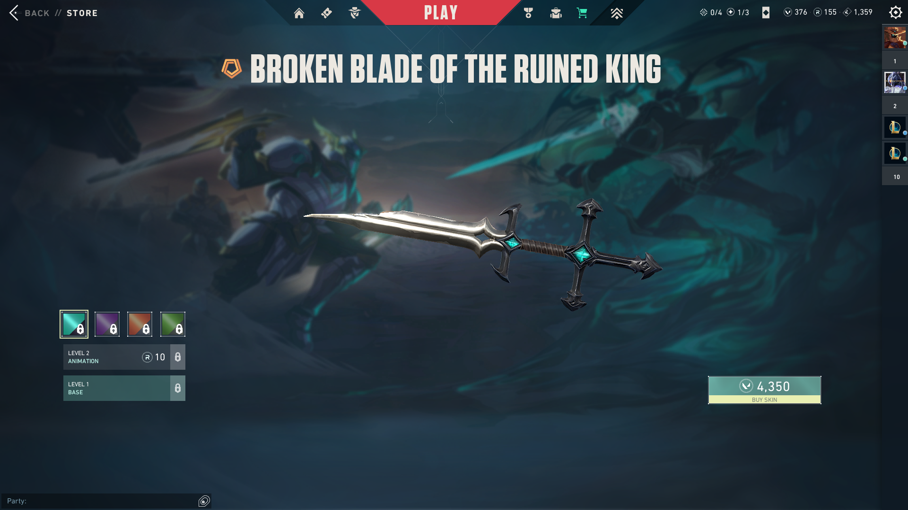

# Valorant VP Cost Minimisation
Imagine this: you just got your paycheck, and you see that shiny new skin set *just* begging you, "want me, love me, buy me!" You can't help but give in, so now you spend the entire next week eating ice soup, wondering if you could have done it cheaper somehow. This simple Python script aims to fix that problem for you, by trivialising the calculation, so all you have to do is buy the pack(s)!

<div align='center'>

<br>
<a href='https://www.reddit.com/r/ValorantMemes/comments/1d0t7h9/that_ice_soup_tho/?utm_source=share&utm_medium=web3x&utm_name=web3xcss&utm_term=1&utm_content=share_button'>Meme</a> originally posted by <a href="https://www.reddit.com/user/CrypticWasXD/">CrypticWasXD</a> in <a href="https://www.reddit.com/r/ValorantMemes/">r/ValorantMemes</a>
</div>

# Contents
- [Introduction](#introduction)
- [Features](#features)
- [Dependencies](#dependencies)
- [Installation](#installation)
- [Usage](#usage)
- [How it works](#how-it-works)
- [Example](#example)

# Introduction
You want skins. Riot wants your money. But why spend more than you have to? This script calculates the *absolute best* way to buy just enough VP without overpaying.

# Features
<b>Optimal Configuration:</b> no need buying more than we need <br>
<b>Minimal Cost:</b> cash saved today is more skins tomorrow...or idk, I'm not a financial advisor <br>
<b>Current Balance:</b> if you are already sitting on some VP, we factor that in so you don't go overboard

# Dependencies
<b>Python 3.x:</b> pretty cool programming language with good support for most applications <br>
<b>PuLP:</b> library that provides structure to solve linear programming optimisation problems

# Installation
1. Ensure you have Python 3 installed.
2. Copy the script <b>valorant.py</b> into a local file or clone the repository:
```bash
https://github.com/jainrishit12/valorant_vp_cost_minimisation.git
```
3. Install the PuLP library:
```python
pip install pulp
```

# Usage
1. Launch the script using the code editor or via the terminal:
```python
python valorant.py
```
2. Input your current VP balance
3. Enter the VP price of your desired item
4. That's it! The script will give you the best combo of VP packs to buy with the least damage to your wallet

# How it works
The script uses <b>linear programming </b> to solve for the minimum cost. Here is a step-by-step breakdown:
1. The script initialises the decision variables, which are the currently available VP packs
2. It sets an objective function, or an optimisation problem, to minimise the total cost bases on VP pack prices
3. It sets constraints ensuring the total VP obtained from purchasing packs plus the current balance is greater than or equal to the required VP
4. PuLP's solver is used to find the optimal pack configuration, such that the cost is minimised

# Example
I made the script yesterday evening because I had been eyeing the 'Broken Blade of the Ruined King' melee skin for quite some time, and it was finally in-store. The skin cost 4,350 VP, and I had a balance of 376 VP.

<div align="center">

Broken Blade of the Ruined King in store for 4350 VP, current balance 376 VP
</div>

<br>Now, the following seem to be the closest to the optimal solution in terms of cost or convenience:
* 2 * €20 packs to gain 4100 VP or <br>
* 1 * €5 and 1 * €35 packs to gain 4125 VP or <br>
* 1 * €50 pack to gain 5350 VP <br>

With this established, we can proceed with the script:
```
how many vp do you currently have? # 376
how many vp does the desired item cost? # 4350
```

The script will output the following:
```
ideal packs configuration to meet required vp:
p1_5_eur_475_vp     =   1 unit(s)
p2_10_eur_1000_vp   =   0 unit(s)
p3_20_eur_2050_vp   =   0 unit(s)
p4_35_eur_3050_vp   =   1 unit(s)
p5_40_eur_5350_vp   =   0 unit(s)
p6_100_eur_11000_vp =   0 unit(s)

optimal cost = 40 eur
total vp from purchased packs = 4125
surplus vp after purchase = 151
```
According the PuLP, the ideal combination uses 1 * €5 pack and 1 * €35 pack. Fortunately, this is one of the combinations which we had previously identified! We can now proceed to spam the inspect button on our new skin :)
